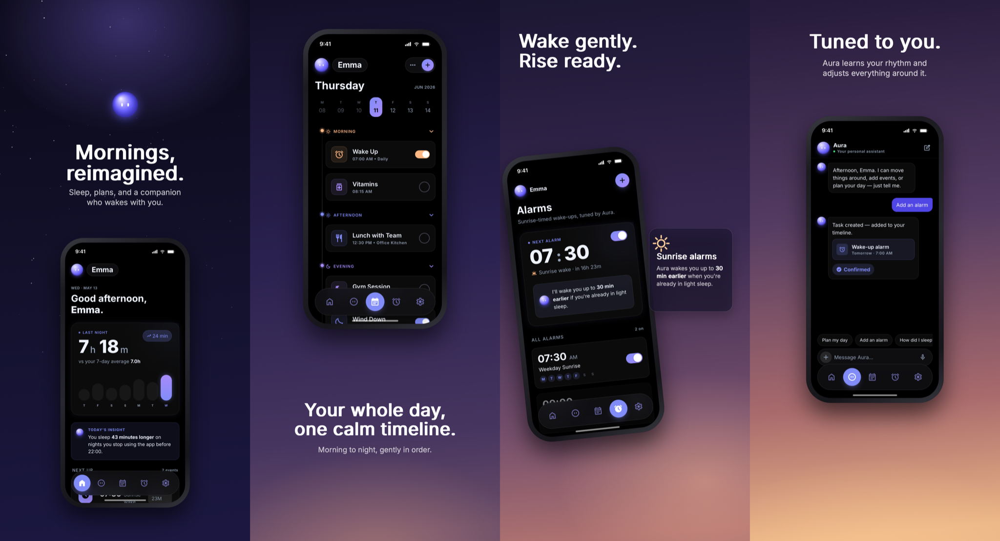
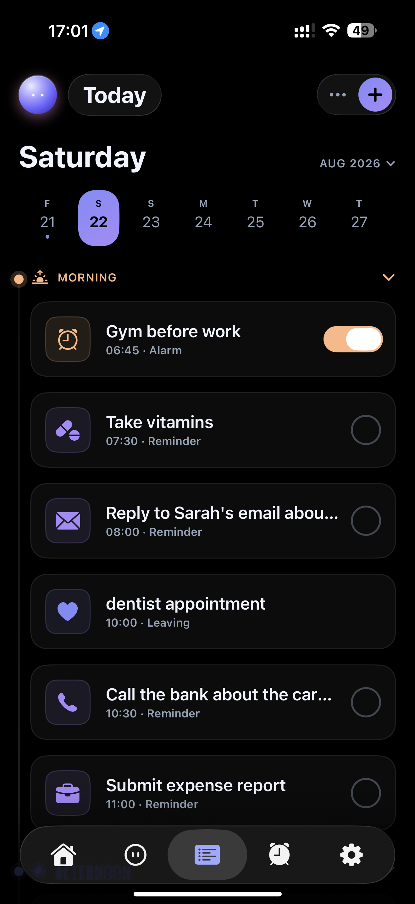
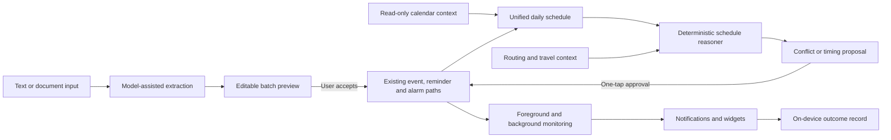
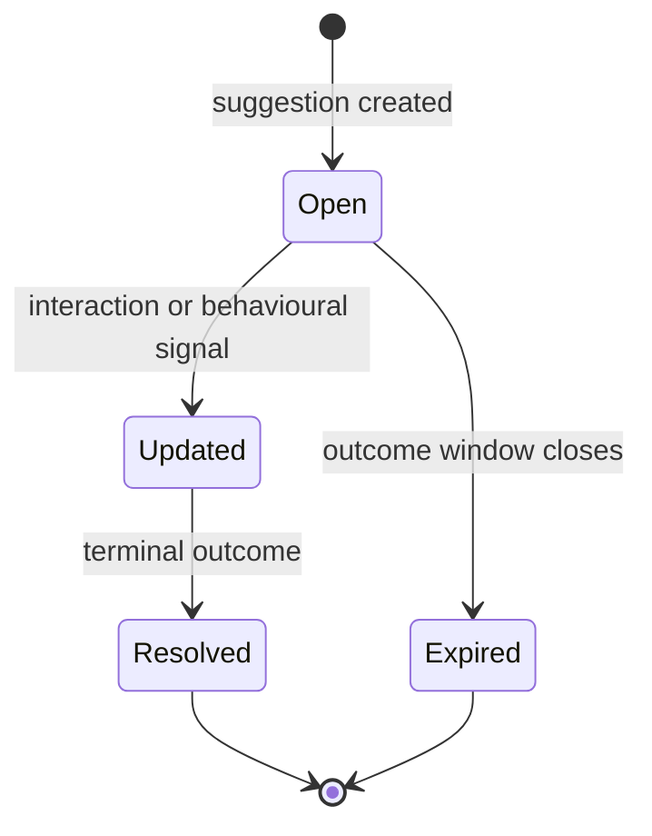

# WakeAI — engineering a proactive system people can trust

**A public engineering case study for a privacy-conscious iOS system that ingests a schedule, reasons across it, proposes useful changes and learns whether its guidance helped.**

> WakeAI is an active private product. This repository documents selected architecture, engineering decisions and lessons without publishing the production codebase, user data, prompts, schemas, credentials or proprietary behavioural logic.

## Product preview

WakeAI is a live product concept. Visit [wakeai.online](https://www.wakeai.online) for the public product site.

  

  

These images show the product surface only; no production data, internal tooling or private implementation details are included.

## The product problem

Most productivity tools wait to be managed. WakeAI is designed around a different loop:

**ingest → understand → reason → propose → monitor → learn**

A user can describe several events at once or provide a document. WakeAI structures the input, exposes uncertainty for correction, creates the accepted items, reasons across the resulting schedule and monitors time-sensitive events. Consequential changes remain under user control.

The difficult part is not generating plausible text. It is building a reliable system around uncertain inputs, changing real-world conditions, background execution limits and the trust cost of a wrong proactive action.

## Shipped capabilities

- Native iOS application built with Swift and SwiftUI, including widgets and notification actions
- Multi-item ingestion from free text and extracted document text
- Editable preview before batch creation, with uncertain items kept visible instead of silently discarded
- Deterministic detection of schedule overlaps and travel-infeasible transitions
- One-tap proposals for changes that would move a user's plans
- Foreground and background leave-time monitoring using routing context
- Durable anonymous-first identity with optional Apple or Google account linking
- Authenticated cloud backup and restore for selected user data
- A bounded on-device behavioural record that captures context, action and outcome for future evaluation

## System architecture

The model is used where ambiguity is unavoidable: turning natural language or extracted document text into candidate structured items. Decisions that can be derived from dates, distances and routes are kept deterministic and testable.

A separate authenticated service boundary protects model-provider credentials and supports account services. Production endpoints and internal deployment details are intentionally omitted here.

## Core engineering decisions

| Problem | Decision | Why it matters |
|---|---|---|
| Model extraction is variable | Preview every multi-item result and preserve uncertain rows | A user can correct one weak item without losing the rest or creating several wrong events |
| Language models are poor at rule precedence | Resolve dates and deterministic constraints in Swift | The same input produces the same temporal result and boundary cases can be tested |
| New ingestion paths can fork behaviour | Route accepted items through the existing creation paths | Notifications, fallback behaviour, coordinate handling and outcome capture stay consistent |
| Silent schedule changes carry high trust cost | Allow additive work, but require approval before moving plans | The product is proactive without becoming presumptuous |
| Conflict detection is numerically testable | Use a deterministic reasoner for overlaps and route feasibility | Explanations cannot claim a conflict that the underlying numbers do not support |
| Routing can fail or be incomplete | Mark pairs as unchecked rather than implying they are safe | Unknown is represented honestly instead of becoming false confidence |
| Background work is constrained on iOS | Combine live checks with bounded fallback scheduling | Useful behaviour degrades gracefully when the app is suspended |
| Early behavioural data is easy to bias | Store an open record until an outcome resolves or expires | Unanswered cases do not disappear and responsive users are not over-represented |

## Behavioural learning without premature modelling

WakeAI does not pretend that a small early dataset justifies a personalised model. The current system builds a clean evaluation foundation first.

Each suggestion creates a bounded lifecycle record:

The record distinguishes direct interaction from weaker behavioural evidence, uses idempotent event-stage keys and expires unresolved cases. This makes the dataset useful for evaluating reliability before it is used for training.

One early result demonstrated the value of this approach: the absence of expected live-engine records exposed that users were receiving scheduled fallbacks while the intended live leave-time path was effectively not firing. Instrumentation revealed a field failure that repeated code inspection had missed.

## Privacy boundary

WakeAI's behavioural design follows a simple rule: **keep the rich context on the device and strictly bound what leaves it.**

- Raw location coordinates are not included in the behavioural record or uploaded as behavioural telemetry
- Derived outcome signals can be stored without retaining a location trail
- Behavioural records are local, bounded by retention and removed with local-data deletion
- Account backup is an authenticated, separately reviewed path rather than a generic telemetry channel
- Production data, private schemas and user records are absent from this repository

Privacy is treated as an architectural constraint, not documentation added after implementation.

## Reliability and graceful failure

The ingestion and orchestration pipeline is designed for partial failure:

- Ambiguous dates or destinations remain editable
- A failed geocode does not invalidate unrelated items in a batch
- A failed route becomes unchecked, not silently feasible
- Long documents are bounded and truncation is surfaced
- Proposals are recalculated when relevant schedule data changes
- Existing single-item behaviour remains available when richer paths fail

The current engineering phase focuses on measuring trust: correction frequency, manual overrides, proposal acceptance and the quality of resolved outcome records. Broader autonomy is deliberately deferred until those signals justify removing confirmation.

## Delivery progression

1. **Durable identity and recovery** — anonymous-first accounts, provider linking, backup, restore and deletion parity
2. **Behavioural evaluation foundation** — lifecycle-managed context/action/outcome records with privacy bounds
3. **Whole-schedule orchestration** — batch ingestion, document input and deterministic cross-item reasoning
4. **Reliability and trust** — active hardening driven first by structured qualitative evidence, then by mature outcome data

This sequence is intentional: establish identity before durable learning, establish measurement before autonomy, and prove one domain deeply before expanding breadth.

## Technology

**Client:** Swift, SwiftUI, WidgetKit, MapKit, EventKit, iOS background tasks and notifications  
**Services:** Python, FastAPI, authenticated AI-service boundary  
**Data and identity:** PostgreSQL, Supabase authentication and row-level access controls  
**AI system design:** structured extraction, deterministic post-processing, human-in-the-loop proposals and outcome-driven evaluation

## What this repository demonstrates

- Product architecture across mobile, backend and data systems
- Applied AI that is more than a thin model wrapper
- Clear boundaries between probabilistic extraction and deterministic decisions
- Privacy-aware instrumentation and retention design
- Failure-mode analysis, incremental delivery and evidence-led technical decisions

## About

Designed and engineered by [Abdullah Nadeem](https://github.com/Abz119).  
Connect on [LinkedIn](https://www.linkedin.com/in/abdullahnadeem17).

This public repository is an engineering case study, not a distribution of the WakeAI source code.
